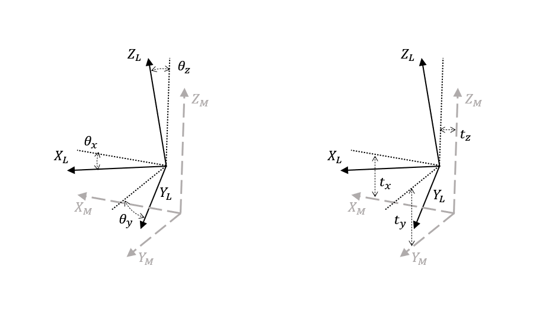

# 这是什么

clb(Calibrate) rl(Rotate Lidar)

这是一个标定激光雷达和旋转电机安装偏差的项目, 具体偏差请看下面图示  
其中 **L** 为激光雷达坐标系, **M** 为电机坐标系, 二者在理想状态下应完全重合, 这样后续拼装数据只需要考虑激光雷达跟随电机的朝向, 但是因为这个安装误差的存在会导致在只考虑电机朝向时原数据出现畸变, 即无法正确还原原始场景


# 项目架构

- 库
  - preprocessor: 一些预处理工具, 包括 io, 拼装, 提取特征等
  - calibrator: 外参矫正算法, 设置好各种配置后直接调用 `run(ans)` 就能得到标定结果
  - utils: 配合 yaml-cpp 读写配置文件
- 可执行文件
  - cmb: 不考虑外部参数的情况下只根据电机朝向组装数据, 从 `raw_dirname` 加载数据, 将组装好的数据保存到`cmb_filename`
  - calib: 根据提取出来的特征进行标定, 读取 `raw_dirname` 和 `obj_dirname`, 标定结果写入 `mat_file_name`
  - apb: 根据 `mat_file_name` 中的外参组装 `raw_dirname` 中的原始数据, 并保存到 `cmb_filename`, 供可视化检验

# 算法

算法参考了以下论文

- J. Kang 和 N. L. Doh, 《Full-DOF Calibration of a Rotating 2-D LIDAR With a Simple Plane Measurement》, IEEE Trans. Robot., 卷 32, 期 5, 页 1245–1263, 10 月 2016, doi: 10.1109/TRO.2016.2596769.

# 测试数据

数据都放在 [谷歌网盘](https://drive.google.com/drive/folders/18LT3ePnCvqa7ZTKOG4ueme7AaqGf5Y5e?usp=drive_link)

- single-line-data：单线激光数据
- multi-line-data：多线激光数据（目前没有）

文件夹结构：
- raw：原始数据
- objs：提取好的平面特征（由用户手动提取，链接里提供的只是一个示范，算法并不会自动提取平面特征）
- resault.yaml：外参计算结果，可以使用 `apb` 程序将标定结果应用到原始数据上，查看标定效果
- cmb_output.ply：`cmb` 程序组合 raw 文件夹下数据得到的结果，用于提取平面特征

# 使用方法

## 拉取代码

```bash
# 添加了 yaml-cpp 的子模块, 所以拉取代码需要加一个选项用于处理子模块的事情🤷
git clone --recursive https://github.com/HopeCollector/clbrl.git
```

## 构建项目

构建项目需要以下组件

- ceres
- pcl
- Eigen

语言标准 c++ 17

```bash
cmake -D CMAKE_BUILD_TYPE=Release -S . -B build
cmake --build build
```

## 原始数据采集方法

1. 确定好激光的旋转轴
2. 激光旋转到某个指定的角度，保持这个角度，尽可能让激光不要抖动
3. 尽可能在电机静止时（有些电机会有抖动）记录一帧激光的数据
4. 将点云数据转换为 pcl::PointXYZI 的类型
5. 将的角度以弧度（rad）写入每一个点的 intensity
6. 将这一帧数据保存为 pcd 格式，文件名为数据采集这一帧数据的序号

最终得到的原始数据看起来就是 0.pcd 1.pcd 2.pcd ... n.pcd 

## 使用

0. 修改 `cfg/config.yaml` , 保证后面程序运行时能找到对应的文件
1. 使用 `caliba_cmb` 将原始数据组装在一起
2. 使用任何一种点云可视化软件将组装结果中面积较大, 点数较多的平面分割出来, 分别保存到不同的文件中, 支持 pcd ply 两种格式
   如果使用 `cloudcompare` 注意保存后的结果中 scalar 部分, 软件会自动添加 **scalar\_** 前缀, 需要删掉
3. 使用 `caliba_clb` 进行外参标定
4. 如果不确定标定效, 可使用 `caliba_apb` 对原始数据应用标定结果, 用可视化软件查看标定结果

## 输出结果

输出的格式为

```yaml
theta: x, y, z
trans: x, y, z
mat: # 4x4 齐次矩阵
  -[row1]
  -[row2]
  -[row3]
  -[row4]
```

